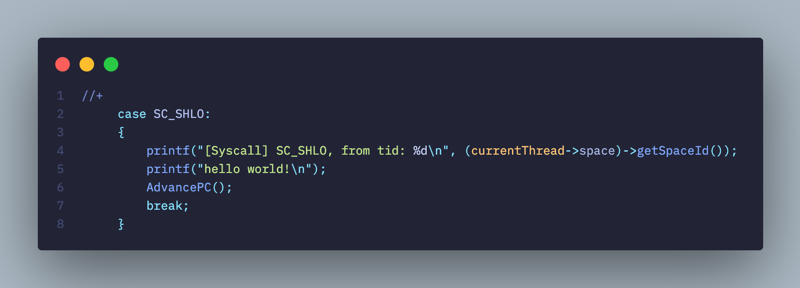

# README

## 山东大学操作系统课程设计

#### LibreOS - NachOS

- 实现了系统Shell
- 实现了文件目录树
- 实现了文件扩展


## 实验6的拓展内容

- 如果有时间，可以实现从 Nachos 的硬盘中加载 Nachos 的应用程序并执行之。
- space 就是该进程的标识，这里并没有像 UNIX 中为每个进程分配一个进程 号（pid，Nachos 中称为 SpaceId），你自己可以为进程分配一个 pid，并建立 pid 与 space 的映射关系，以后通过 pid 标识该进程。
- 对于一个真正的操作系统，理论上讲，不应该创建进程后立刻执行，而应该将进 程放入就绪队列，等待进程的调度。
- Nachos 目前不支持多进程。
- 目前 Nachos 默认的线程调度算法是 FCFS。当然，你可以利用 Thread::Yield()模拟抢先机制。
- 在实现系统调用 Fork()之前，Nachos 不支持用户多线程机制（可以认为只有一个 线程，否则无法建立进程与核心线程的映射关系）；要求系统调用 Fork()实现在同一个用户空间中创建多个用户线程，并建立用户线程与核心线程之间的映射，映射关系最简单的就是 One to One 模型。

## 已修改内容

- [ ] Addrspace
- [ ] Thread
- [ ] Scheduler
- [ ] List
- [x] Openfile（直接复制粘贴实验4）
- [x] exception.cc

## 调试方法

- 你可以加上参数 –d m 输出显示 Nachos 模拟的 MIPS CPU 所执行的每条指 令，即 `nachos –d m –x/halt.noff`, 还可以再加上参数-s，以输出每条指令执行后对应寄存器的状态，如 `nachos –d m –s –x/halt.noff`。

## 地址空间的扩展


#### 从内存分配的角度看，nachos为什么无法实现多进程

- 创建进程地址空间的主要过程分为三步。首先创建用户程序页表，然后清空 Machine 物理空间数据，最后将 noff 文件中`对应的内容`拷贝到 Machine 的物理内存中`对应的位置`。
- 在`AddrSpace::AddrSpace(OpenFile *executable)`下，实现了上述为创建地址空间而进行的一系列操作。其中`bzero(machine->mainMemory,size);`在创建地址空间时，把模拟机的内存`完全清空`了。
- 这就导致，就算再创建一个进程，新进程执行完毕，也不可能回到上一个进程了。因为它`老家都给薅了`。

#### 为实现多进程创造条件

- 可见，实现多进程的前提是能让新进程加入时，也得给老进程`留条活路`。
- 于是可以考虑像管理磁盘块那样管理内存页。仍然使用`bitmap`的方式来管理即可。


## PCB和SpaceID


#### 现有nachos进程调度存在的问题

- 一个可执行文件被读入，则立即切换上下文，并覆盖内存，从而使新进程得到立刻执行。
- 但是现实操作系统中，一般会先创建一个PCB，然后等待调度机调度这个新进程。只有被调度了，才可以进入执行。


#### nachos的进程如何被内核感知

- nachos中没有PCB的显式定义。Nachos 主要通过 StartProcess() 函数中的 `space = new AddrSpace(executable)` 这一段代码创建了进程，即在 Nachos 中用户进程并没有设立专门的 PCB 文件，而是用一个用户地址空间来指代这个进程。

- 我认为，用用户空间来指代这个进程是`合理的`。因为用户空间中已经存放了在nachos环境下，这个进程的所有必要信息，包括进程的页表、用户栈指针、核心线程映射等信息。它已经`足以标志`一个进程，只不过没有被显示地称为PCB。

- 因为调度的基本单位是线程，所以寄存器等上下文信息为用户线程所持有，我认为`无可厚非`。这些寄存器由进程持有没有意义。线程所在的进程只需要负责系统资源的分配和管理即可，`不需要干涉`线程是如何执行的。

	- 因为nachos中的线程调度由系统`kernel`实现，并不是类似`pthread`那种用户线程库实现的。所以进程`不需要`对用户线程的调度`负责`。

	

#### nachos是单核心线程（支持多用户线程）、单进程的操作系统。如何完成用户线程到核心线程的映射？


- 每个用户线程都持有其空间。空间中保存了进程执行的上下文。
- nachos`只存在一个`核心线程。因为它只有一个`currentThread`被定义出来。
- nachos中采用一对一映射。把需要调度的线程所持有的空间地址传给核心线程，即完成了调度。也就是`currentThread->space = space`。

## 实现地址空间的扩展

#### 几个常量

| 常量              | 值   | 解释       |
| ----------------- | ---- | ---------- |
| NumPhysPages      | 64   | 物理页框数 |
| MAX_USERPROCESSES | 256  | 最大进程数 |

## 实现多进程

#### 对类Addrspace进行扩充

- 首先，我们已经明确可以继续使用一块地址空间来标识一个用户进程。于是可以考虑一个能够唯一标志这段地址空间的编号，从而来唯一标志这个进程。

#### 实现PID

- 关于PID，需要考虑如下两个方面：
	- 它是如何产生的
	- 在内核中如何记录它，以便 Join() 能够通过该值找到对应的线程
- 可以考虑效仿unix类操作系统，为一个进程分配一个唯一的整数。


第一种方案，为一个地址空间对应进程分配一个唯一整数


在 Nachos 中，核心可支持多线程机制，系统初始化时创建了一个主线程 main，以后可以利用 Thread::Fork() 创建多个核心线程，这些核心线程可以并发执行。其实，Nachos 要求用户自己实现系统调用 Fork()，以创建多个并发执行的用户进程，与系统调用 Yield() 联合使用。


目前在系统调用 Fork() 实现之前，系统只能运行一个用户进程，不支持多线程机制。系统调用 Exec() 可以在一个用户进程中加载另一个程序运行。因此进程的 Pid 即 SpaceId 可以用下述的方法产生。


从 …/userprog/protest.cc 中的 StartProcess() 中可以看出，加载运行一个应用程序的过程就是首先打开这个程序文件，为该程序分配一个新的内存空间，并将该程序装入到该空间中，然后将该进程映射到一个核心线程上，根据文件的头部信息设置相应的寄存器运行该程序。


这里进程地址空间的首地址是唯一的，理论上可以利用该值识别该进程，但该值不连续，且值过大。因此我们借鉴 UNIX 的思想，为一个地址空间或该地址空间对应的进程分配一个唯一的整数，例如 0-99 预留为核心进程使用（目前没有核心进程的概念，核心中只有线程），用户进程号从 100 开始使用。


目前 Nachos 没有实现子进程或子线程的概念（进程、线程之间没有建立进程树），因此对于 Nachos 的第一个应用程序，其 SpaceId 即 pid = 100，当该程序调用 Exec(filename) 加载运行 filename 指定的文件的时，为 filename 对应的文件分配 101，以此类推。


当一个程序调用系统调用 Exit() 退出时，应当收回为其分配的 pid 号，以分配给后续的应用程序，同时应释放其所占用的内存空间及页表等信息，供后续进程使用。


第二种方案，利用 Thread::Fork() 的第二个参数将进程 pid 传入核心中


Thread::Fork(VoidFunctionPtr func, _int arg) 有两个参数，一个是线程要运行的代码，另一个是一个整数，可以考虑将用户进程映射到核心线程时，利用 Fork() 的第二个参数将进程的 pid 传入到核心中。


- 

## 底层危险修改

- 为适配shell，`directory.h`中，修改文件名长度为`32`，原来是`9`.

#### 运行一个程序

- 在test下完成了编译后，运行 `nachos –x/halt.noff`


- 即可开机，执行，停机。


## 系统调用的实现

#### nachos模拟机实现系统调用的原理


- 系统调用是通过陷入内核态来实现的。在OS课程中了解到，如果要陷入内核态，需要触发一个`exception`，或者说`trap`。
- 在`mipssim.cc`下，`OneInstruction`函数实现了对mips指令集的执行模拟。其中，`OP_SYSCALL`实现了指令`syscall`。其原理是引发一个`exception`。和猜测相符，它引发了一个`SyscallException`，确实是用这种方式实现的。


- 在`RaiseException`中，看到机器是如何触发一个例外的。它利用延迟寄存器（通过`DelayedLoad()`方法进行操作）来写入`BadVAddr`（引发例外的内存地址），从而可以追踪到底是哪里崩了。因为这里只想要触发一个`访管中断`，所以引发的地址填0就行。


- 在`Machine`下，有`DelayedLoad()`的具体实现。延迟寄存器的原理是：在本次delayedload时，把上一次要写入的值写入目标寄存器，然后记录下一次要写入的值和目标寄存器（这个新来的值，同理，会在下一次调用delayedload时被写入目标寄存器中）
	- 目标寄存器和值都是自定义的。因为系统中有`LoadReg`、`LoadValueReg`专门为延迟写入进行服务，分别存放下次要写入的值和要写到的目标寄存器的编号。

- nachos中对各种`exception`的处理是在`/exception.cc`下实现的。由nachos作者留下的注释：


- 首先，nachos依赖的mips模拟机的相关逻辑，会实现当一个`exception`被触发。

#### start.s——任意nachos应用程序的backbone

- 我们从`test/start.s`中，可以看到`syscall.h`里面声明的各系统调用函数。以halt为例：


- `Halt`以标号的形式给出，在这个过程中，调用了mips指令syscall，于是就执行了上面我们所研究的过程。


- 观察整个汇编文件，可以看到，nachos的任何用户程序都是从`__start`这个标号开始执行的。它会跳转到main标号，然后跳转到`Exit`标号（也就是执行`Exit()`系统调用），这就是一个`nachos`应用程序的生命周期。
- 这个`start.s`包含了如何执行一个应用程序，如何正确退出一个应用程序，以及提供nachos环境下的系统调用接口。如果应用程序要进行系统调用，则可以依赖于这个`start.s`提供的`运行环境`。
- 因此，实际上它并不支持很多C语言的方法，因为系统调用有限，而且还是自己实现的。

- 同时，根据nachos作者留下的注释：


- 可以看到，系统调用采用`寄存器`的方式进行参数传递和结果返回。系统调用号在`$2`，参数依次放在`$4`,`$5`,`$6`,`$7`，如果更多就用栈传递；系统调用返回时，返回值在`$2`.


#### 用户程序进行系统调用的过程（汇编层面）

- 使用命令 `/usr/local/mips/bin/decstation-ultrix-gcc -I ../userprog -I ../threads -S joinTest.c`，把`joinTest.c`编译生成中间汇编代码`joinTest.s`，然后研究该汇编代码。


- 上图：`joinTest.c`，下图：`joinTest.s`的部分代码


- 在标号`$LC0`下，对程序的内存空间进行了定义。首先存储了ASCII码表示的可执行文件名称。
- 然后进入`.text`段。其中规定了对齐方式为2字节对齐（16bits为单位），定义全局符号main，然后定义程序入口是标号main。


- 进入main标号，首先配置栈帧、可能用到的通用寄存器和返回值所用的寄存器。
- mips汇编伪指令 `.frame` 用来声明堆栈布局，该指令有三个参数：第一个参数 `framereg`: 声明用于访问局部堆栈的寄存器，一般为`sp` ；第二个参数 `framesize`: 声明该函数已分配堆栈的大小，符合 `sp+framesize = sp`；第三个参数 `return reg`: 这个寄存器用来保存返回地址.
- mips汇编伪指令`.mask` 指定要存储的寄存器以及它们的存储位置。位掩码中应为每个保存的寄存器打开位（例如，如果保存了寄存器 `$31`，位掩码中的位 `31` 应为“`1`”。位在位掩码中以小端顺序设置，即使机器配置为大 - endian)。
- mips汇编伪指令`.fmask` 的作用和`.mask` 类似，只不过操作了浮点寄存器。


- 然后分配栈帧。`$sp-32->$sp`，即让栈生长了4个字节。


- 跳转到`__main`处，开始执行本用户程序。


- 从`$LC0`取地址送给`$4`，于是完成了系统调用`Exec()`的参数传递工作。然后，`jal Exec`即可执行`start.s`里面提供的系统调用例程。
- 系统调用返回后，执行`sw $2->16($fp)`，把`Exec()`的返回值存到函数的用户空间中。也就对应了c文件中的赋值语句`SpaceId newProc = Exec("exitTest.noff");`的实现。
- 所以我们发现SpaceId现在在用户空间中的位置就是地址 `16($fp)`。
- 之后，要进入`Join()`系统调用。汇编实现如下：


- 可见，真的从地址`16($fp)`中取出`SpaceID`作为参数传递给`$4`（也就是`Join()`系统调用的第一个参数）了！
- 参数既然传递完成，继续执行`jal Join`就开始执行`start.s`中定义的`Join()`例程了。


- 都完成了，就要对应到程序中的`return 0;`语句了。实际上是通过调用`Exit()`系统调用实现的，于是与`Exit(0)`的效果是一样的。
- 值得注意的是，根据计算机系统原理的知识，mips中规定`$0`的值恒为`0`。所以这里就是传值0给系统调用例程。也就是`return 0`的`0`.

#### 系统调用的几种传值方式（汇编层面）

- 上面我们分析了`joinTest.c`的汇编代码，可以总结如下：
- 方式1：寄存器传参数所在地址
	- 在`Exec()`例程中，传参数的方式是 `la $4,$LC0`，也就是把一段连续地址空间的首地址作为参数传给寄存器。
	- 在`Join()`例程中，传参数的方式是`lw $4,16($fp)`，也就是把一段连续地址空间的首地址作为参数传给寄存器。
- 方式2：寄存器传参数
	- 在`Exit()`例程中，传参数的方式是`move $4,$0`，也就是说如果系统调用的参数是数值类型，可以把一个立即数直接传给寄存器。
- 方式3：栈
	- 下面通过一个实验给出验证。

#### 探究在何时使用栈进行参数传递（汇编层面）；同时探究如何自定义新的系统调用。

- 在`syscall.h`中新增`SC_SHLO`（SayHello）系统调用，调用号为11.


- 在`syscall.h`中新增`sayHello()`系统调用，让他包含大于4个参数（这里定义了6个参数）


- 然后，在`exceptions.cc`中提供对该系统调用例外的响应实现：我们让他被调用时输出hello world。



- 然后，在`start.s`中添加对`SayHello()`系统调用例程的实现：


- 最后，写一个程序`sayHelloTest.c`去尝试调用它：


- 上面是测试程序的运行结果。白框里面得到了我们的预期输出。
- 下面，使用命令`/usr/local/mips/bin/decstation-ultrix-gcc -I ../userprog -I ../threads -S sayHelloTest.c`，把 `sayHelloTest.c`编译成汇编代码 `sayHelloTest.s`。

- 汇编代码如下：

```assembly
	.file	1 "sayHelloTest.c"
gcc2_compiled.:
__gnu_compiled_c:
	.text
	.align	2
	.globl	main
	.ent	main
main:
	.frame	$fp,32,$31		# vars= 0, regs= 2/0, args= 24, extra= 0
	.mask	0xc0000000,-4
	.fmask	0x00000000,0
	subu	$sp,$sp,32
	sw	$31,28($sp)
	sw	$fp,24($sp)
	move	$fp,$sp
	jal	__main
	li	$2,5			# 0x00000005
	sw	$2,16($sp)
	li	$2,6			# 0x00000006
	sw	$2,20($sp)
	li	$4,1			# 0x00000001
	li	$5,2			# 0x00000002
	li	$6,3			# 0x00000003
	li	$7,4			# 0x00000004
	jal	SayHello
	move	$4,$0
	jal	Exit
$L1:
	move	$sp,$fp
	lw	$31,28($sp)
	lw	$fp,24($sp)
	addu	$sp,$sp,32
	j	$31
	.end	main
```

- 很容易发现，因为我们传入立即数`(1,2,3,4,5,6)`作为参数：
	- 指令 `li $4,1`一直到指令 `li $7,4`对前4个立即数进行了寄存器传值方式的参数传递。
	- 而 `li $2,5`，然后 `sw $2,16($sp)`则是把第5个立即数先暂存到 `$2`，然后再压入函数栈帧。可见，是用栈的方式进行传递了。
	- 第6个参数同理，也是用栈实现的。

#### 当心造成死循环——AdvancePC()方法的引入

- `Machine`下的 `OneInstruction`方法实现了mips模拟机的执行周期。它的结构主要是：
	- 在switch中根据操作码执行对应指令功能
	- 跳出switch后进行PC更新
	- 具体细节不再阐述，实验6中已有研究
- 即：

```c++
	switch(OP_CODE){
            //...
        case OP_SYSCALL:
            RaiseException(SyscallException, 0);
            return;

        case OP_XOR:
            registers[instr->rd] = registers[instr->rs] ^ registers[instr->rt];
            break;
            //...
    } 	

	// Do any delayed load operation
    DelayedLoad(nextLoadReg, nextLoadValue);
    
    // Advance program counters.
    registers[PrevPCReg] = registers[PCReg];	// for debugging, in case we
						// are jumping into lala-land
    registers[PCReg] = registers[NextPCReg];
    registers[NextPCReg] = pcAfter;
```

- 值得注意的是，除`OP_SYSCALL`外，其他的指令都是`break`的，唯独它是`return`。
- 这就导致如果执行`OP_SYSCALL`，就不能触及到下面的`PC`更新环节，导致`PC`一直不能自增，从而进入无限循环。
- 有一种解决方案是把`return`换成`break`。但是这样`不够美`，虽然能实现目的，但是却和nachos的设计并不相符——因为系统调用通过`RaiseException()`实现，而作为一个`Exception`，它本应该`return`。也就是当一个例外（软中断）出现了，应当解决这个例外，并尝试重启这条指令。
- 于是考虑在执行系统调用例程的过程中`手动`对`PC`进行更新操作。也就是把下面那段代码单独摘出来，写成`AdvancePC()`方法，然后在系统调用具体实现中调用即可。

```c++
 // Advance program counters.
    registers[PrevPCReg] = registers[PCReg];	// for debugging, in case we
						// are jumping into lala-land
    registers[PCReg] = registers[NextPCReg];
    registers[NextPCReg] = pcAfter;
```

- 于是可以在`exception.cc`中调用，解决这个问题：（如白框）


- 于是，这样就不会出现死循环的问题了：正确输出了hello world。


#### 实现Join()系统调用

- 实现`join()`的大体思路：应当传入一个`joinee`的`tid`。然后，`joiner`应当在结束队列中寻找`joinee`。如果还没有到结束队列中来，就进入等待。然后等`joinee`来唤醒它。如果在`joiner`调用`join()`时，`joinee`已经结束，则直接做`joinee`结束的后处理即可，无需等待。
- 该大体思路的实现在`/thread.cc`的`void Thread::Join(int SpaceId)`下。


- 首先，在`exception.cc`中创建`SC_Join`的`case`。
  - 在这里，获得传入的参数（即`joinee`的`tid`）。系统调用的参数传递通过寄存器进行。
  - 然后，让当前线程进入`Join`。
  - 当`Join`返回，作为父线程，需要做子线程退出的后处理。这里父线程把子线程返回的状态码写入`$2`寄存器。
- 然后，像其他系统调用的实现一样，应当`AdvancePC`。因为系统调用属于`exception`，当遇到`exception`，应当打断进程执行，当错误处理后，重新执行这个引发`exception`的指令。但是系统调用希望进程继续执行下去，所以需要手动`AdvancePC`，从而防止重复执行系统调用，进入循环。
- `AdvancePC`的实现如下：


- 事实上，`AdvancePC`读取前一个`PC`写入`PrevPC`，读取`NextPC`写入`PC`，计算`NextPC+4`写入`NextPC`。于是就完成了这三个`PC`相关寄存器的“增1”更新。
- 在`test`下，创建`joinTest.c`：


- 在`test`下，创建`exitTest.c`：


- 运行命令`./nachos -x joinTest.noff`（事先已将`joinTest`编译并拷贝到nachos磁盘上的根目录中），从而测试`join()`系统调用的功能。


- 成功测试。
- 首先分配页面。然后`tid 100`开始执行，之后`exec`了一个`exitTest`子程序（`tid 101`），同时`tid 100`进入等待。
- `exitTest`子程序退出时，自身先进行系统调用`exit()` 唤醒`tid 100`，于是醒`tid 100`也进行系统调用`exit()` ，所有线程都结束执行。

#### 实现Exec()系统调用

- 要实现`Exec()`，意味着需要让nachos支持多进程。该系统调用的意图在于创建一个全新的进程并执行它。
- nachos不支持多进程的原因在前面已经探讨。在地址空间扩展实验的基础上，nachos现已具备实现多进程的条件。

#### 运行yield、join、exit综合测试

- 在`test`下，创建`joinTest.c`：


- 在`test`下，创建`yieldTest.c`：


- 在`test`下，创建`exitTest.c`：


- 修改makefile，编译这三个新的用户程序：


- 修改运行脚本，由于我们采用`nachos`内部文件系统：
	- 我们在用户程序编写中，采用的文件路径是`nachos`内部路径。
	- 所以我们提前把编译好的文件拷贝进`nachos`磁盘的根目录。
	- 对`lint.sh`做如下添加：


- 于是可以开始测试程序，有如下输出：


- 分析上述执行过程，可以发现具体执行顺序如下。
- 将/joinTest.noff 用户程序映射到 main 线程上，此时分配 SpaceId = 100。
	main 线程执行 Exec(/yieldTest.noff) 系统调用，并产生新用户程序/yieldTest.noff，并分配 SpaceId = 101。
- main 线程继续执行 Join() 系统调用，等待/yieldTest.noff 执行完毕，因此此时调度到线程/yieldTest.noff 上执行。
- /yieldTest.noff 线程执行 Exec(/exitTest.noff) 系统调用，并产生新用户程序/exitTest.noff，并分配 SpaceId = 102。
- /yieldTest.noff 继续线程执行 Yield() 系统调用，此时调度到/exitTest.noff 上继续执行。此时没有调度到 main 上继续执行，证明 main 线程此时在等待队列中，而非可运行态队列，也证实了 Join 系统调用执行正确。
- /exitTest.noff 执行 Exit() 系统调用，成为第一个结束的用户程序。接下来调度到/joinTest.noff 线程上继续执行。
- /joinTest.noff 执行 Exit() 系统调用，成为第二个结束的用户程序。由于/joinTest.noff 运行结束，因此重新调度到 main 上执行。
- 最后 main 执行 Exit() 系统调用，成为第三个结束的用户程序，此时 joinTest.noff 程序运行结束。
- 由上述的运行结果以及对于运行结果的分析，可以得知 Exec()、Exit()、Yield()、Join() 这四个系统调用均实现正确。


#### 运行文件相关系统调用综合测试

- 一开始是这样的：


- 然后运行，发现：


- 发现问题：写入文件后，不能正确地读取文件。
- 打印读写指针位置后，发现了问题：因为写入结束时，读写指针位于文件尾部。如果仍然从该位置开始读，可不报错吗！因为`Read`调用了`ReadAt`，而`ReadAt`有如下检查：


- 可见，如果读写指针位置不对，返回读取有效字节数0.
- 于是，需要实现`fseek`系统调用，或者重新打开文件以解决问题。


- 然后重新编译用户程序`fileTest.c` ，运行：


- 如图中方框所示，成功读取！

