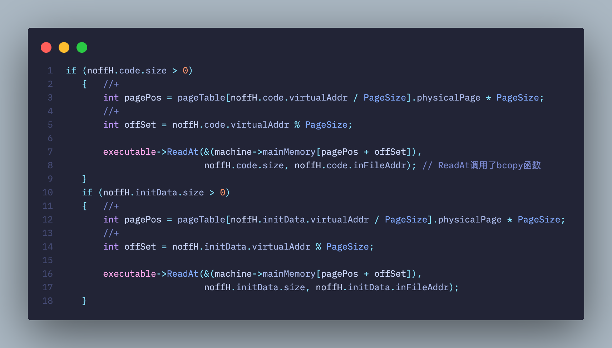

# README

#### LibreOS - NachOS

- 实现了系统Shell
- 实现了文件目录树
- 实现了文件扩展


## 实验6的拓展内容

- 如果有时间，可以实现从 Nachos 的硬盘中加载 Nachos 的应用程序并执行之。
- space 就是该进程的标识，这里并没有像 UNIX 中为每个进程分配一个进程 号（pid，Nachos 中称为 SpaceId），你自己可以为进程分配一个 pid，并建立 pid 与 space 的映射关系，以后通过 pid 标识该进程。
- 对于一个真正的操作系统，理论上讲，不应该创建进程后立刻执行，而应该将进 程放入就绪队列，等待进程的调度。
- Nachos 目前不支持多进程。
- 目前 Nachos 默认的线程调度算法是 FCFS。当然，你可以利用 Thread::Yield()模拟抢先机制。
- 在实现系统调用 Fork()之前，Nachos 不支持用户多线程机制（可以认为只有一个 线程，否则无法建立进程与核心线程的映射关系）；要求系统调用 Fork()实现在同一个用户空间中创建多个用户线程，并建立用户线程与核心线程之间的映射，映射关系最简单的就是 One to One 模型。

## 已修改内容

- [ ] Addrspace
- [ ] Thread
- [ ] Scheduler
- [ ] List
- [x] Openfile（直接复制粘贴实验4）
- [x] exception.cc

# 实验7

## 调试方法

- 你可以加上参数 –d m 输出显示 Nachos 模拟的 MIPS CPU 所执行的每条指 令，即 `nachos –d m –x/halt.noff`, 还可以再加上参数-s，以输出每条指令执行后对应寄存器的状态，如 `nachos –d m –s –x/halt.noff`。

## 地址空间的扩展


#### 从内存分配的角度看，nachos为什么无法实现多进程

- 创建进程地址空间的主要过程分为三步。首先创建用户程序页表，然后清空 Machine 物理空间数据，最后将 noff 文件中`对应的内容`拷贝到 Machine 的物理内存中`对应的位置`。
- 在`AddrSpace::AddrSpace(OpenFile *executable)`下，实现了上述为创建地址空间而进行的一系列操作。其中`bzero(machine->mainMemory,size);`在创建地址空间时，把模拟机的内存`完全清空`了。
- 这就导致，就算再创建一个进程，新进程执行完毕，也不可能回到上一个进程了。因为它`老家都给薅了`。

#### 为实现多进程创造条件

- 可见，实现多进程的前提是能让新进程加入时，也得给老进程`留条活路`。
- 于是可以考虑像管理磁盘块那样管理内存页。仍然使用`bitmap`的方式来管理即可。

#### 几个常量

| 常量              | 值   | 解释       |
| ----------------- | ---- | ---------- |
| NumPhysPages      | 64   | 物理页框数 |
| MAX_USERPROCESSES | 256  | 最大进程数 |

## 研究：关于PCB和SpaceID


#### 现有nachos进程调度存在的问题

- 一个可执行文件被读入，则立即切换上下文，并覆盖内存，从而使新进程得到立刻执行。
- 但是现实操作系统中，一般会先创建一个PCB，然后等待调度机调度这个新进程。只有被调度了，才可以进入执行。


#### nachos的进程如何被内核感知

- nachos中没有PCB的显式定义。Nachos 主要通过 StartProcess() 函数中的 `space = new AddrSpace(executable)` 这一段代码创建了进程，即在 Nachos 中用户进程并没有设立专门的 PCB 文件，而是用一个用户地址空间来指代这个进程。

- 我认为，用用户空间来指代这个进程是`合理的`。因为用户空间中已经存放了在nachos环境下，这个进程的所有必要信息，包括进程的页表、用户栈指针、核心线程映射等信息。它已经`足以标志`一个进程，只不过没有被显示地称为PCB。

- 因为调度的基本单位是线程，所以寄存器等上下文信息为用户线程所持有，我认为`无可厚非`。这些寄存器由进程持有没有意义。线程所在的进程只需要负责系统资源的分配和管理即可，`不需要干涉`线程是如何执行的。

	- 因为nachos中的线程调度由系统`kernel`实现，并不是类似`pthread`那种用户线程库实现的。所以进程`不需要`对用户线程的调度`负责`。

	

#### nachos是多核心线程、单进程的操作系统。如何完成用户线程到核心线程的映射？


- 每个用户线程都持有其空间。空间中保存了进程执行的上下文。
- nachos`只存在一个`核心线程。因为它只有一个`currentThread`被定义出来。
- nachos中采用一对一映射。把需要调度的线程所持有的空间地址传给核心线程，即完成了调度。也就是`currentThread->space = space`。


## 实现多进程

#### 对类Addrspace（PCB）进行扩充

- 首先，我们已经明确可以继续使用一块地址空间来标识一个用户进程。于是可以考虑一个能够唯一标志这段地址空间的编号，从而来唯一标志这个进程。


- 我们增加userMap，pidMap，并且这俩声明为static，也就是整个操作系统只维护了一份userMap、pidMap，且是全局的。
- 他们和lab4中的位图是一个东西。不过分别用于记录未分配的页框号、未分配的PID。
- 另外，增加spaceId，也就是当做PID来使用。spaceId的实现见下方。


- 此外，在PCB中添加文件系统相关内容。这里的fileDescriptor是Openfile构成的数组，其记录了这个进程打开的所有文件。**这相当于Linux下的U区**。

#### 对PCB进行完善：实现PID

- 关于PID，需要考虑如下两个方面：
	- 它是如何产生的
	- 在内核中如何记录它，以便 Join() 能够通过该值找到对应的线程
- 可以考虑效仿unix类操作系统，为一个进程分配一个唯一的整数。为了方便系统实现，可以保留一些编号。
- 这里指定0-31号为系统所有，而用户编号从32开始，一直到256+32 = 288.目前 Nachos 没有实现子进程或子线程的概念（进程、线程之间没有建立进程树），因此对于 Nachos 的第一个应用程序，其 SpaceId 即 pid = 32，当该程序调用 Exec(filename) 加载运行 filename 指定的文件的时，为 filename 对应的文件分配 33，以此类推。
- 具体可以通过位示图来记录可用的编号，然后将空闲编号再加一个偏移量32作为分配结果，即可实现这个思想。这样分配出来的编号都是>=32的。可以在如下几个实现处进行相关处理：


- 如图，也就是在`Addrspace`创建时，对位示图分配结果加偏移量32；在`Addrspace`释放时，先减偏移量32，获得真实的位示图的key，再释放该位。
- 在 Nachos 中，核心可支持多线程机制，系统初始化时创建了一个主线程 main，以后可以利用 Thread::Fork() 创建多个核心线程，这些核心线程可以并发执行。其实，Nachos 要求用户自己实现系统调用 Fork()，以创建多个并发执行的用户进程，与系统调用 Yield() 联合使用。目前在系统调用 Fork() 实现之前，系统只能运行一个用户进程，不支持多线程机制。系统调用 Exec() 可以在一个用户进程中加载另一个程序运行。因此进程的 Pid 即 SpaceId 可以用下述的方法产生。
- 当一个程序调用系统调用 Exit() 退出时，应当收回为其分配的 pid 号，以分配给后续的应用程序，同时应释放其所占用的内存空间及页表等信息，供后续进程使用。


- 还可以用编号31来标志父进程的退出，这样即可实现判断返回值来确定是否是父进程。如果是，则释放当前所有的`Terminated`进程。因为这些进程都被视为该进程的子进程。

#### 对PCB进行完善：实现多进程环境下，进程的创建

- 首先，根据上面的方法，分配一个PID。


- 然后，进行初始化：
	- 从nachos磁盘上读取noff可执行文件
	- 验证Magic Number
	- 计算所需地址空间大小，并确定所需分配页数，验证合法性


- 之后，创建进程页表
	- 首先再次确认页面足够分配
	- 然后初始化进程的页表：给每个页表项进行初始化



- 然后，把进程的内容拷入内存
	- 拷入代码段
	- 拷入已初始化数据段


- 最后，初始化`stdin`、`stdout`、`stderr`三个标准设备文件。


#### 对PCB进行完善：实现进程上下文切换


- 之前，nachos只实现了RestoreState()方法，用于将进程的页表映射到系统页表上面。
- 现在，我们继续实现SaveState()方法，用于在切换时把系统页表保存回用户页表，从而让进程的上下文作为映像保存起来。

#### 对PCB进行完善：支持Openfile


- 这些函数添加进来，主要是为进程的文件操作提供支持。
- getFileDescriptor()方法为打开的文件分配一个fd。如果fd已用完则返回-1.
- 剩余两个函数不再赘述。

# 实验8

## nachos中的进程和线程 - 最终总结

#### Addrspace示例实际上就是进程实体

- nachos中的进程是资源分配的基本单位。在nachos中，一个`Addrspace`实际上就是一个进程。因为这个`Addrspace`类中包含了诸如pid、U区（进程打开文件表）、进程页表等内容，可以说本身就是一个`PCB`了。
- 当一个nachos进程被创建（通过后续即将实现的`Exec`系统调用），一个新的核心线程就被创建，并指定这个线程的`space`是这个进程的`Addrspace`。因此可见，线程的`space`实际上是这个线程运行的环境。而进程的作用就是为线程提供环境。
- 当这个核心线程被创建，利用其`Fork`方法创建唯一一个用户线程，并让该核心线程进入就绪队列，当`scheduler`调度执行它，新进程就跑起来了。

#### nachos中的Thread类是核心线程的概念，而非用户线程的概念

- 因为根据操作系统相关概念，只有核心线程才能被调度、被执行。
- 在nachos中，`scheduler`操作的对象就是`Thread`的实例，因此我们可以认为这个`Thread`实际上是核心线程。

#### nachos中没有类似pthread这种提供用户多线程的机制吗？为什么只支持一对一映射？

- nachos并没有很好地实现`Thread`类的`fork()`方法。
- 值得注意的是，Fork的时候栈空间是暴力替换的。这就导致目前而言，单个进程不能实现多个线程的并发。
- nachos中的用户线程是由核心线程创建的，而且还只能创建一个，否则之前的那个用户线程就会被覆盖。这就是nachos只支持一对一映射的根本原因。


- 上图来源于`lab3`中的生产者-消费者模型实现。可以看到，我们当时实现并发，并不是直接用`Fork()`来创建新的用户线程，而是对每个并发者都创建其核心线程来实现的。
- 这是因为根据我们的分析，nachos是一对一的，那么只能通过这种方式才能实现并发。

#### 用户线程如何映射到核心线程

- nachos中的用户线程是由核心线程创建的（调用`Thread::Fork()`），而且还只能创建一个，否则之前的那个用户线程就会被覆盖。
- 当一个核心线程调用`Thread::Fork()`，就创建映射了一个全新的用户线程。实际上只是为其指定了执行函数，分配了栈空间。

#### nachos进程、用户线程、核心线程的关系；nachos如何实现进程调度

- 可见，进程里面可以创建很多用户线程，而一个核心线程只能被一个用户线程所映射。
- 如果要实现上述的这种模型，基本的代码逻辑如下，比如要在这个进程里面创建n个用户线程，则：
	- 内核创建n个`Thread`示例（实际上就是创建n个核心线程）；
	- 分别初始化这n个`Thread`的运行函数、栈空间（实际上就是分别指定n个用户线程的映像，然后把他们分别赋给这n个核心线程）；
- 因为不存在用户线程库，所以这n个用户线程在用户空间内没有任何先后关系、调度关系。他们完全依靠所映射的核心线程完成调度。
- **当线程被调度，就相当于所在进程被调度了**。以上面这种情况而言，这个进程下面所属的任何一个核心线程被调度，都属于是这个进程被调度了。值得注意的是，对于不同进程包含的线程来说，他们的地位是平等的。nachos对这些平等的线程之间采用FCFS或轮转法（如果加上种子）来调度。


## 底层危险修改

- 为适配shell，`directory.h`中，修改文件名长度为`32`，原来是`9`.

#### 运行一个程序

- 在test下完成了编译后，运行 `nachos –x/halt.noff`


- 即可开机，执行，停机。


## 系统调用的原理探究

#### nachos模拟机实现系统调用的原理


- 系统调用是通过陷入内核态来实现的。在OS课程中了解到，如果要陷入内核态，需要触发一个`exception`，或者说`trap`。
- 在`mipssim.cc`下，`OneInstruction`函数实现了对mips指令集的执行模拟。其中，`OP_SYSCALL`实现了指令`syscall`。其原理是引发一个`exception`。和猜测相符，它引发了一个`SyscallException`，确实是用这种方式实现的。


- 在`RaiseException`中，看到机器是如何触发一个例外的。它利用延迟寄存器（通过`DelayedLoad()`方法进行操作）来写入`BadVAddr`（引发例外的内存地址），从而可以追踪到底是哪里崩了。因为这里只想要触发一个`访管中断`，所以引发的地址填0就行。


- 在`Machine`下，有`DelayedLoad()`的具体实现。延迟寄存器的原理是：在本次delayedload时，把上一次要写入的值写入目标寄存器，然后记录下一次要写入的值和目标寄存器（这个新来的值，同理，会在下一次调用delayedload时被写入目标寄存器中）
	- 目标寄存器和值都是自定义的。因为系统中有`LoadReg`、`LoadValueReg`专门为延迟写入进行服务，分别存放下次要写入的值和要写到的目标寄存器的编号。

- nachos中对各种`exception`的处理是在`/exception.cc`下实现的。由nachos作者留下的注释：


- 首先，nachos依赖的mips模拟机的相关逻辑，会实现当一个`exception`被触发。

#### start.s——任意nachos应用程序的backbone

- 我们从`test/start.s`中，可以看到`syscall.h`里面声明的各系统调用函数。以halt为例：


- `Halt`以标号的形式给出，在这个过程中，调用了mips指令syscall，于是就执行了上面我们所研究的过程。


- 观察整个汇编文件，可以看到，nachos的任何用户程序都是从`__start`这个标号开始执行的。它会跳转到main标号，然后跳转到`Exit`标号（也就是执行`Exit()`系统调用），这就是一个`nachos`应用程序的生命周期。
- 这个`start.s`包含了如何执行一个应用程序，如何正确退出一个应用程序，以及提供nachos环境下的系统调用接口。如果应用程序要进行系统调用，则可以依赖于这个`start.s`提供的`运行环境`。
- 因此，实际上它并不支持很多C语言的方法，因为系统调用有限，而且还是自己实现的。

- 同时，根据nachos作者留下的注释：


- 可以看到，系统调用采用`寄存器`的方式进行参数传递和结果返回。系统调用号在`$2`，参数依次放在`$4`,`$5`,`$6`,`$7`，如果更多就用栈传递；系统调用返回时，返回值在`$2`.


#### 用户程序进行系统调用的过程（汇编层面）

- 使用命令 `/usr/local/mips/bin/decstation-ultrix-gcc -I ../userprog -I ../threads -S joinTest.c`，把`joinTest.c`编译生成中间汇编代码`joinTest.s`，然后研究该汇编代码。


- 上图：`joinTest.c`，下图：`joinTest.s`的部分代码


- 在标号`$LC0`下，对程序的内存空间进行了定义。首先存储了ASCII码表示的可执行文件名称。
- 然后进入`.text`段。其中规定了对齐方式为2字节对齐（16bits为单位），定义全局符号main，然后定义程序入口是标号main。


- 进入main标号，首先配置栈帧、可能用到的通用寄存器和返回值所用的寄存器。
- mips汇编伪指令 `.frame` 用来声明堆栈布局，该指令有三个参数：第一个参数 `framereg`: 声明用于访问局部堆栈的寄存器，一般为`sp` ；第二个参数 `framesize`: 声明该函数已分配堆栈的大小，符合 `sp+framesize = sp`；第三个参数 `return reg`: 这个寄存器用来保存返回地址.
- mips汇编伪指令`.mask` 指定要存储的寄存器以及它们的存储位置。位掩码中应为每个保存的寄存器打开位（例如，如果保存了寄存器 `$31`，位掩码中的位 `31` 应为“`1`”。位在位掩码中以小端顺序设置，即使机器配置为大 - endian)。
- mips汇编伪指令`.fmask` 的作用和`.mask` 类似，只不过操作了浮点寄存器。


- 然后分配栈帧。`$sp-32->$sp`，即让栈生长了4个字节。


- 跳转到`__main`处，开始执行本用户程序。


- 从`$LC0`取地址送给`$4`，于是完成了系统调用`Exec()`的参数传递工作。然后，`jal Exec`即可执行`start.s`里面提供的系统调用例程。
- 系统调用返回后，执行`sw $2->16($fp)`，把`Exec()`的返回值存到函数的用户空间中。也就对应了c文件中的赋值语句`SpaceId newProc = Exec("exitTest.noff");`的实现。
- 所以我们发现SpaceId现在在用户空间中的位置就是地址 `16($fp)`。
- 之后，要进入`Join()`系统调用。汇编实现如下：


- 可见，真的从地址`16($fp)`中取出`SpaceID`作为参数传递给`$4`（也就是`Join()`系统调用的第一个参数）了！
- 参数既然传递完成，继续执行`jal Join`就开始执行`start.s`中定义的`Join()`例程了。


- 都完成了，就要对应到程序中的`return 0;`语句了。实际上是通过调用`Exit()`系统调用实现的，于是与`Exit(0)`的效果是一样的。
- 值得注意的是，根据计算机系统原理的知识，mips中规定`$0`的值恒为`0`。所以这里就是传值0给系统调用例程。也就是`return 0`的`0`.

#### 系统调用的几种传值方式（汇编层面）

- 上面我们分析了`joinTest.c`的汇编代码，可以总结如下：
- 方式1：寄存器传参数所在地址
	- 在`Exec()`例程中，传参数的方式是 `la $4,$LC0`，也就是把一段连续地址空间的首地址作为参数传给寄存器。
	- 在`Join()`例程中，传参数的方式是`lw $4,16($fp)`，也就是把一段连续地址空间的首地址作为参数传给寄存器。
- 方式2：寄存器传参数
	- 在`Exit()`例程中，传参数的方式是`move $4,$0`，也就是说如果系统调用的参数是数值类型，可以把一个立即数直接传给寄存器。
- 方式3：栈
	- 下面通过一个实验给出验证。

#### 探究在何时使用栈进行参数传递（汇编层面）；同时探究如何自定义新的系统调用。

- 在`syscall.h`中新增`SC_SHLO`（SayHello）系统调用，调用号为11.


- 在`syscall.h`中新增`sayHello()`系统调用，让他包含大于4个参数（这里定义了6个参数）


- 然后，在`exceptions.cc`中提供对该系统调用例外的响应实现：我们让他被调用时输出hello world。


- 然后，在`start.s`中添加对`SayHello()`系统调用例程的实现：


- 最后，写一个程序`sayHelloTest.c`去尝试调用它：


- 上面是测试程序的运行结果。白框里面得到了我们的预期输出。
- 下面，使用命令`/usr/local/mips/bin/decstation-ultrix-gcc -I ../userprog -I ../threads -S sayHelloTest.c`，把 `sayHelloTest.c`编译成汇编代码 `sayHelloTest.s`。

- 汇编代码如下：

```assembly
	.file	1 "sayHelloTest.c"
gcc2_compiled.:
__gnu_compiled_c:
	.text
	.align	2
	.globl	main
	.ent	main
main:
	.frame	$fp,32,$31		# vars= 0, regs= 2/0, args= 24, extra= 0
	.mask	0xc0000000,-4
	.fmask	0x00000000,0
	subu	$sp,$sp,32
	sw	$31,28($sp)
	sw	$fp,24($sp)
	move	$fp,$sp
	jal	__main
	li	$2,5			# 0x00000005
	sw	$2,16($sp)
	li	$2,6			# 0x00000006
	sw	$2,20($sp)
	li	$4,1			# 0x00000001
	li	$5,2			# 0x00000002
	li	$6,3			# 0x00000003
	li	$7,4			# 0x00000004
	jal	SayHello
	move	$4,$0
	jal	Exit
$L1:
	move	$sp,$fp
	lw	$31,28($sp)
	lw	$fp,24($sp)
	addu	$sp,$sp,32
	j	$31
	.end	main
```

- 很容易发现，因为我们传入立即数`(1,2,3,4,5,6)`作为参数：
	- 指令 `li $4,1`一直到指令 `li $7,4`对前4个立即数进行了寄存器传值方式的参数传递。
	- 而 `li $2,5`，然后 `sw $2,16($sp)`则是把第5个立即数先暂存到 `$2`，然后再压入函数栈帧。可见，是用栈的方式进行传递了。
	- 第6个参数同理，也是用栈实现的。

#### 当心造成死循环——AdvancePC()方法的引入

- `Machine`下的 `OneInstruction`方法实现了mips模拟机的执行周期。它的结构主要是：
	- 在switch中根据操作码执行对应指令功能
	- 跳出switch后进行PC更新
	- 具体细节不再阐述，实验6中已有研究
- 即：

```c++
	switch(OP_CODE){
            //...
        case OP_SYSCALL:
            RaiseException(SyscallException, 0);
            return;

        case OP_XOR:
            registers[instr->rd] = registers[instr->rs] ^ registers[instr->rt];
            break;
            //...
    } 	

	// Do any delayed load operation
    DelayedLoad(nextLoadReg, nextLoadValue);
    
    // Advance program counters.
    registers[PrevPCReg] = registers[PCReg];	// for debugging, in case we
						// are jumping into lala-land
    registers[PCReg] = registers[NextPCReg];
    registers[NextPCReg] = pcAfter;
```

- 值得注意的是，除`OP_SYSCALL`外，其他的指令都是`break`的，唯独它是`return`。
- 这就导致如果执行`OP_SYSCALL`，就不能触及到下面的`PC`更新环节，导致`PC`一直不能自增，从而进入无限循环。
- 有一种解决方案是把`return`换成`break`。但是这样`不够美`，虽然能实现目的，但是却和nachos的设计并不相符——因为系统调用通过`RaiseException()`实现，而作为一个`Exception`，它本应该`return`。也就是当一个例外（软中断）出现了，应当解决这个例外，并尝试重启这条指令。
- 于是考虑在执行系统调用例程的过程中`手动`对`PC`进行更新操作。也就是把下面那段代码单独摘出来，写成`AdvancePC()`方法，然后在系统调用具体实现中调用即可。

```c++
 // Advance program counters.
    registers[PrevPCReg] = registers[PCReg];	// for debugging, in case we
						// are jumping into lala-land
    registers[PCReg] = registers[NextPCReg];
    registers[NextPCReg] = pcAfter;
```

- 于是可以在`exception.cc`中调用，解决这个问题：（如白框）


- 于是，这样就不会出现死循环的问题了：正确输出了hello world。


## 系统调用例程编写的基本框架——以Hello World系统调用为例

#### 系统调用例程由三大部分构成

- nachos通过例外实现系统调用。在例外处理函数中，会对不同的例外进行switch-case。我们只需要新增一个自己的case，例如上面所说的case SC_SHLO。
- 在这个case中，需要实现三部分逻辑：
	- **获取系统调用参数。**这往往在传参使用的寄存器中。但是如果它传递的是地址，你还需要额外的访存操作。如果还用到了栈，那么还需要手动读取所在栈帧。
	- **实际功能。**利用传入的参数，实现个性化功能。只有这些功能涉及到内核操作，才会更有意义。
	- 后处理
		- **写入返回参数。**需要把返回值写入`$2`寄存器。
		- **AdvancePC。**这是为了防止死循环，因为系统把访管中断当做错误来处理。

#### 获取系统调用参数


- 这是Open()系统调用中获取需要打开的文件名的过程。参数传递所使用的寄存器处获取了文件名存放的首地址。然后读该地址即可。
- 如果并不是传的地址，那就更简单了。直接拿过来就用。但是这种情况，一个寄存器只能传递单个数据作为调用参数，例如一个整型数据。

#### 调用结束后处理


- `$2`寄存器专门用于存放返回值。（这在之前的汇编代码研究中有解释过），因此只需要把返回值写入它，就完成了返回值的回带。（这里的fileID是期望带回的int类型返回值）
- 最后不要忘记手动增加PC。


## 实现系统调用Join()

#### 为何添加Terminated状态

- Terminated状态是必要的。相比于直接Exit，可以把即将退出的joinee线程转换至Terminated状态，并加入相应的Terminated队列。这样，父线程如果要join一个线程：
	- 如果Terminated队列里面有joinee，则joiner就可以在Terminated队列里面找从而直接join成功
	- 或者进入睡眠，直到在joinee进入Terminated状态再唤醒joiner
- 另外，增加Thread::Join()方法和Thread::Terminated()方法。


- 并且在线程状态中添加TERMINATED这个新状态。

#### 增强List的功能，以实现更高级的队列操作


- 在List.h中，添加RemoveItem()，listFirst()方法，分别是任意从队列中删除一个元素，以及拿出队列的首个元素。
- 这些都为后续的Terminated队列的实现提供了便利。

#### 为scheduler类添加Terminated队列和Waiting队列


- 如图。主要是添加了这两个队列和相关操作方法。代码清晰，不再赘述。
	- 后面在join()的实现中离不开这两个新队列。

#### 修改Thread的Finish()方法，从而使joinee能够去唤醒joiner


- 主要增加如下逻辑
	- 在waitingList中找一遍（里面的线程都属于是进入睡眠了的），看看有哪个线程在等着自己。
	- 如果有这样的进程，那么它就是自己的joiner了，那么就唤醒它（让他ReadyToRun，并且从waitingList移除），同时设置它（joiner）的waitExitCode是自己（joinee）的exitCode，这就相当于joiner把joinee的返回信息带回了。
	- 然后joinee就可以愉快地进入Terminated状态了。

#### 实现Terminated状态


- 主要实现如下逻辑
	- 首先，把该线程放入Terminated队列，设置当前状态为Terminated。
	- 然后，让scheduler寻找下一个可以跑的线程，否则Idle。

#### 为Thread实现Join()方法

- 在类Thread中，添加如下成员


- 同时，增加相关方法


- 这些修改主要是为Join()的实现做准备。因为在Join时：应当传入一个`joinee`的`tid`。然后，`joiner`应当在结束队列中寻找`joinee`。如果还没有到结束队列中来，就进入等待。然后等`joinee`来唤醒它。如果在`joiner`调用`join()`时，`joinee`已经结束，则直接做`joinee`结束的后处理即可，无需等待。
- 于是，就有如下几个问题：
	- 怎么记录joiner正在等哪个joinee？
	- 如何落实父线程“为退出的子线程做后续工作”的责任？
- 记录waitProcessSpaceId，从而记录joiner在等谁；记录waitProcessExitCode，从而记录joinee的退出返回值，从而为父线程带回子线程的返回值创造条件。


- 然后，具体实现一下Thread::Join()。


- 首先进行预处理，拿到系统的TerminatedList，WaitingList，明确需要joinee的PID，备用。


- 扫描TerminatedList，如果joinee在里面，那就直接回收exitCode，完成join。


- 否则，就说明joinee尚未执行完毕。那么joiner只能先进入等待。待joinee结束了，再来唤醒joiner。


- 如果joiner执行到了这段代码，那么要么是直接join完成了，要么是当时没join上，后来joinee把它唤醒从而join了。
- 也就是说这段代码是joiner大梦初醒时候执行的。主要是把joinee彻底删掉，**从而完成“父线程回收子线程所用的资源”的使命。**

#### 实现Join()系统调用

实现`join()`的大体思路：应当传入一个`joinee`的`tid`。然后，`joiner`应当在结束队列中寻找`joinee`。如果还没有到结束队列中来，就进入等待。然后等`joinee`来唤醒它。如果在`joiner`调用`join()`时，`joinee`已经结束，则直接做`joinee`结束的后处理即可，无需等待。

- 该大体思路的实现在`/thread.cc`的`void Thread::Join(int SpaceId)`下。


- 首先，在`exception.cc`中创建`SC_Join`的`case`。
  - 在这里，获得传入的参数（即`joinee`的`tid`）。系统调用的参数传递通过寄存器进行。
  - 然后，让当前线程进入`Join`。
  - 当`Join`返回，作为父线程，需要做子线程退出的后处理。这里父线程把子线程返回的状态码写入`$2`寄存器。
- 然后，像其他系统调用的实现一样，应当`AdvancePC`。因为系统调用属于`exception`，当遇到`exception`，应当打断进程执行，当错误处理后，重新执行这个引发`exception`的指令。但是系统调用希望进程继续执行下去，所以需要手动`AdvancePC`，从而防止重复执行系统调用，进入循环。
- `AdvancePC`的实现如下：


- 事实上，`AdvancePC`读取前一个`PC`写入`PrevPC`，读取`NextPC`写入`PC`，计算`NextPC+4`写入`NextPC`。于是就完成了这三个`PC`相关寄存器的“增1”更新。
- 在`test`下，创建`joinTest.c`：


- 在`test`下，创建`exitTest.c`：


#### 测试Join()系统调用

运行命令`./nachos -x joinTest.noff`（事先已将`joinTest`编译并拷贝到nachos磁盘上的根目录中），从而测试`join()`系统调用的功能。


- 成功测试。
- 首先分配页面。然后`tid 100`开始执行，之后`exec`了一个`exitTest`子程序（`tid 101`），同时`tid 100`进入等待。
- `exitTest`子程序退出时，自身先进行系统调用`exit()` 唤醒`tid 100`，于是醒`tid 100`也进行系统调用`exit()` ，所有线程都结束执行。


## 实现系统调用Exec()

#### Exec()的思想

- nachos中的进程是资源分配的基本单位。在nachos中，一个`Addrspace`实际上就是一个进程。因为这个`Addrspace`类中包含了诸如pid、U区（进程打开文件表）、进程页表等内容，可以说本身就是一个`PCB`了。
- 当一个nachos进程被创建（通过后续即将实现的`Exec`系统调用），一个新的核心线程就被创建，并指定这个线程的`space`是这个进程的`Addrspace`。因此可见，线程的`space`实际上是这个线程运行的环境。而进程的作用就是为线程提供环境。
- 当这个核心线程被创建，利用其`Fork`方法创建唯一一个用户线程，并让该核心线程进入就绪队列，当`scheduler`调度执行它，新进程就跑起来了。
- 以上思想，可以用来实现`Exec()`系统调用。

#### 实现Exec()系统调用

- 要实现`Exec()`，意味着需要让nachos支持多进程。该系统调用的意图在于创建一个全新的进程并执行它。
- nachos不支持多进程的原因在前面已经探讨（为什么要进行地址空间的扩展）。在地址空间扩展实验的基础上，nachos现已具备实现多进程的条件。
- nachos实现多进程调度的方法前面已经探讨（nachos中的进程和线程）。一句话来说就是一个进程的任意一个用户线程映射的核心线程被调度了，那这个进程就被调度了。
- 首先，读取要执行的可执行文件。


- 在引发`exception`时，寄存器把文件名存放的内存地址传过来了。这里只需要根据这个地址去找就能把需要执行的可执行文件的文件名拿过来。
- 然后，读取即可。同lab4-lab5。


- 然后，如图，建立了`Addrspace`对象。根据前面我们的探讨，这个就是进程实体了。


- 然后，如图，内核中建立了一个新的核心线程。现在它是一个空核心线程。没有可执行的上下文和环境。


- 之后，把用户线程映射到这个核心线程。
- `thread->space = space;`赋予了核心线程所在进程的上下文，从而为核心进程的执行提供资源。
- `thread->Fork(StartProcess,(int)space->getSpaceId());`为核心线程指定执行环境，并把pid作为参数传给他。其中，`startProcess()`方法如下：


- 这个函数主要是给这个核心线程设定了上下文，设置了内存空间。一切就绪后，就可以运行了。
- 实际上这一步就是把用户线程映射到核心线程，因为用户线程实际上就是个映像。这里就是把映像实体化了。

## 实现内核调度相关的其他系统调用

#### 实现Exit()系统调用


- 首先明确，如果线程Exit，那么所在进程也Exit了。
- 如果线程要Exit，那么需要完成以下事情
	- 带回返回值：通过写入`$2`寄存器实现，在系统调用返回时带回
	- 释放内存等资源：删除这个核心线程以及核心线程所在进程的space
- 此外，如果这个线程被认为是父线程，那么所有已结束的子线程也应当同时被终止。（我们默认整个nachos系统中只有一个是父线程）

#### 实现Yield()系统调用


- Yield系统调用实现非常简单。它调用核心线程类Thread的Yield方法即可。
- 无需传参，无需返回值。


## 实现文件系统相关的其他系统调用

#### 为文件描述符类OpenFile添加标准设备支持

- 在Openfile中，添加Readstdin、WriteStdout函数。


- 在ReadStdin中，从0号文件读入数据。


- 在WriteStdout中，向1号设备写入数据。

#### 实现Open()系统调用

- 在Exceptions.cc中，添加SC_Open case。


- 首先，获取要Open的文件名。它和Exec的实现类似，都是从参数传递所使用的寄存器处获取了文件名存放的首地址。然后读该地址即可。


- 然后，在U区中为之分配新的fd。


- 将分配的新fd作为返回值带回。

#### 实现Create()系统调用


- 仍然是系统调用的基本框架：传参并处理，功能实现，调用返回。于是不再赘述。
- 在功能实现方面，只需调用lab4中实现的Filesys::Create方法。

#### 实现Write()系统调用


- 值得注意的是，这里因为参数达到了三个，所以用到了`$4`,`$5`,`$6`寄存器。


- 处理地址参数，从对应地址处读取要写入文件的数据


- 写入文件，并进行调用返回。其方法和lab4一样。

#### 实现Read()系统调用

- 仍然是系统调用的基本框架：传参并处理，功能实现，调用返回。且文件操作相关实现和Write()系统调用基本一致，于是不再赘述。


#### 实现Close()系统调用


- 如果要关闭一个文件，需要考虑如下实现
	- **写回文件头。**因为如果在file被open的过程中更新了文件头的一些内容（例如大小信息），那么需要在这个时候写回。
	- 释放文件描述符
- 实现如图。


## 综合测试

#### 运行yield、join、exit综合测试

- 在`test`下，创建`joinTest.c`：


- 在`test`下，创建`yieldTest.c`：


- 在`test`下，创建`exitTest.c`：


- 修改makefile，编译这三个新的用户程序：


- 修改运行脚本，由于我们采用`nachos`内部文件系统：
	- 我们在用户程序编写中，采用的文件路径是`nachos`内部路径。
	- 所以我们提前把编译好的文件拷贝进`nachos`磁盘的根目录。
	- 对`lint.sh`做如下添加：


- 于是可以开始测试程序，有如下输出：


- 分析上述执行过程，可以发现具体执行顺序如下。
- 将/joinTest.noff 用户程序映射到 main 线程上，此时分配 SpaceId = 100。
	main 线程执行 Exec(/yieldTest.noff) 系统调用，并产生新用户程序/yieldTest.noff，并分配 SpaceId = 101。
- main 线程继续执行 Join() 系统调用，等待/yieldTest.noff 执行完毕，因此此时调度到线程/yieldTest.noff 上执行。
- /yieldTest.noff 线程执行 Exec(/exitTest.noff) 系统调用，并产生新用户程序/exitTest.noff，并分配 SpaceId = 102。
- /yieldTest.noff 继续线程执行 Yield() 系统调用，此时调度到/exitTest.noff 上继续执行。此时没有调度到 main 上继续执行，证明 main 线程此时在等待队列中，而非可运行态队列，也证实了 Join 系统调用执行正确。
- /exitTest.noff 执行 Exit() 系统调用，成为第一个结束的用户程序。接下来调度到/joinTest.noff 线程上继续执行。
- /joinTest.noff 执行 Exit() 系统调用，成为第二个结束的用户程序。由于/joinTest.noff 运行结束，因此重新调度到 main 上执行。
- 最后 main 执行 Exit() 系统调用，成为第三个结束的用户程序，此时 joinTest.noff 程序运行结束。
- 由上述的运行结果以及对于运行结果的分析，可以得知 Exec()、Exit()、Yield()、Join() 这四个系统调用均实现正确。


#### 运行文件相关系统调用综合测试

- 一开始是这样的：


- 然后运行，发现：


- 发现问题：写入文件后，不能正确地读取文件。
- 打印读写指针位置后，发现了问题：因为写入结束时，读写指针位于文件尾部。如果仍然从该位置开始读，可不报错吗！因为`Read`调用了`ReadAt`，而`ReadAt`有如下检查：


- 可见，如果读写指针位置不对，返回读取有效字节数0.
- 于是，需要实现`fseek`系统调用，或者重新打开文件以解决问题。


- 然后重新编译用户程序`fileTest.c` ，运行：


- 如图中方框所示，成功读取！

