# 实验7-1

## 实验6的拓展内容

- 如果有时间，可以实现从 Nachos 的硬盘中加载 Nachos 的应用程序并执行之。
- space 就是该进程的标识，这里并没有像 UNIX 中为每个进程分配一个进程 号（pid，Nachos 中称为 SpaceId），你自己可以为进程分配一个 pid，并建立 pid 与 space 的映射关系，以后通过 pid 标识该进程。
- 对于一个真正的操作系统，理论上讲，不应该创建进程后立刻执行，而应该将进 程放入就绪队列，等待进程的调度。
- Nachos 目前不支持多进程。
- 目前 Nachos 默认的线程调度算法是 FCFS。当然，你可以利用 Thread::Yield()模拟抢先机制。
- 在实现系统调用 Fork()之前，Nachos 不支持用户多线程机制（可以认为只有一个 线程，否则无法建立进程与核心线程的映射关系）；要求系统调用 Fork()实现在同一个用户空间中创建多个用户线程，并建立用户线程与核心线程之间的映射，映射关系最简单的就是 One to One 模型。

## 调试方法

- 你可以加上参数 –d m 输出显示 Nachos 模拟的 MIPS CPU 所执行的每条指 令，即 `nachos –d m –x/halt.noff`, 还可以再加上参数-s，以输出每条指令执行后对应寄存器的状态，如 `nachos –d m –s –x/halt.noff`。

## 底层危险修改

- `directory.h`中，修改文件名长度为`32`，原来是`9`.

#### 运行一个程序

- 在test下完成了编译后，运行 `nachos –x/halt.noff`

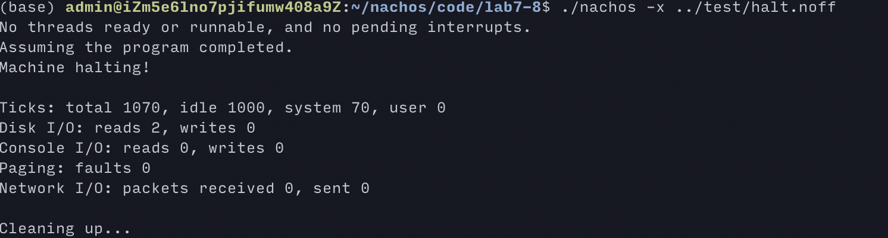

- 即可开机，执行，停机。

#### 实现join()系统调用

- 实现`join()`的大体思路：应当传入一个`joinee`的`tid`。然后，`joiner`应当在结束队列中寻找`joinee`。如果还没有到结束队列中来，就进入等待。然后等`joinee`来唤醒它。如果在`joiner`调用`join()`时，`joinee`已经结束，则直接做`joinee`结束的后处理即可，无需等待。
- 该大体思路的实现在`/thread.cc`的`void Thread::Join(int SpaceId)`下。

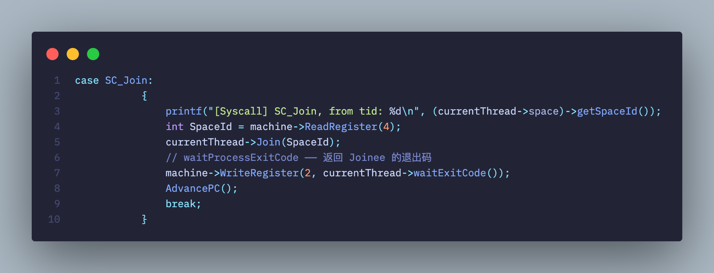

- 首先，在`exception.cc`中创建`SC_Join`的`case`。
  - 在这里，获得传入的参数（即`joinee`的`tid`）。系统调用的参数传递通过寄存器进行。
  - 然后，让当前线程进入`Join`。
  - 当`Join`返回，作为父线程，需要做子线程退出的后处理。这里父线程把子线程返回的状态码写入`$2`寄存器。
- 然后，像其他系统调用的实现一样，应当`AdvancePC`。因为系统调用属于`exception`，当遇到`exception`，应当打断进程执行，当错误处理后，重新执行这个引发`exception`的指令。但是系统调用希望进程继续执行下去，所以需要手动`AdvancePC`，从而防止重复执行系统调用，进入循环。
- `AdvancePC`的实现如下：

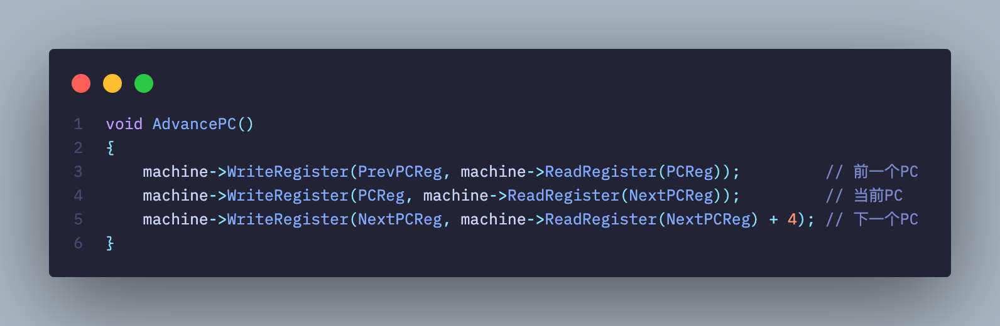

- 事实上，`AdvancePC`读取前一个`PC`写入`PrevPC`，读取`NextPC`写入`PC`，计算`NextPC+4`写入`NextPC`。于是就完成了这三个`PC`相关寄存器的“增1”更新。
- 在`test`下，创建`joinTest.c`：

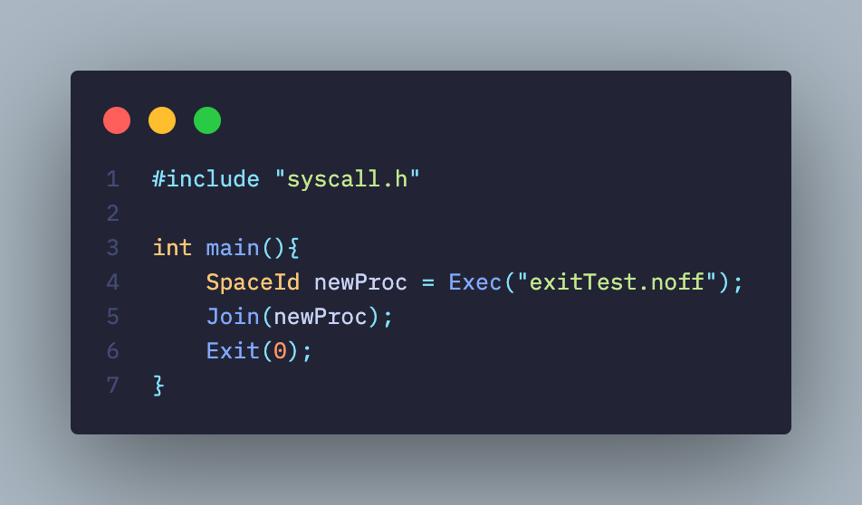

- 在`test`下，创建`exitTest.c`：

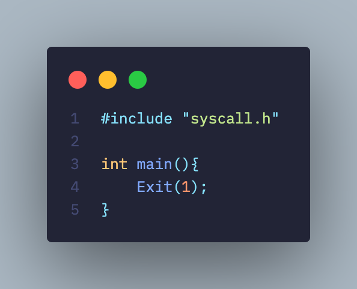

- 运行命令`./nachos -x joinTest.noff`（事先已将`joinTest`编译并拷贝到nachos磁盘上的根目录中），从而测试`join()`系统调用的功能。

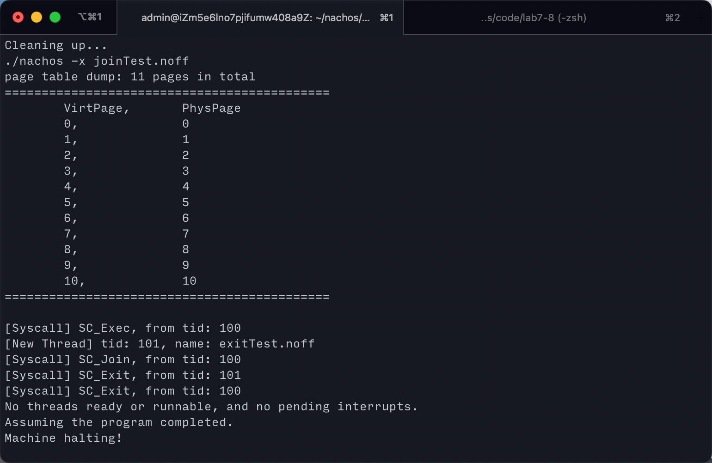

- 成功测试。
- 首先分配页面。然后`tid 100`开始执行，之后`exec`了一个`exitTest`子程序（`tid 101`），同时`tid 100`进入等待。
- `exitTest`子程序退出时，自身先进行系统调用`exit()` 唤醒`tid 100`，于是醒`tid 100`也进行系统调用`exit()` ，所有线程都结束执行。

#### 运行yield、join、exit综合测试

- 在`test`下，创建`joinTest.c`：

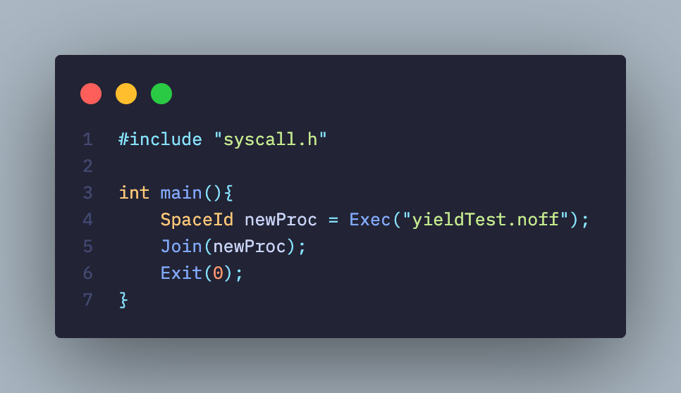

- 在`test`下，创建`yieldTest.c`：

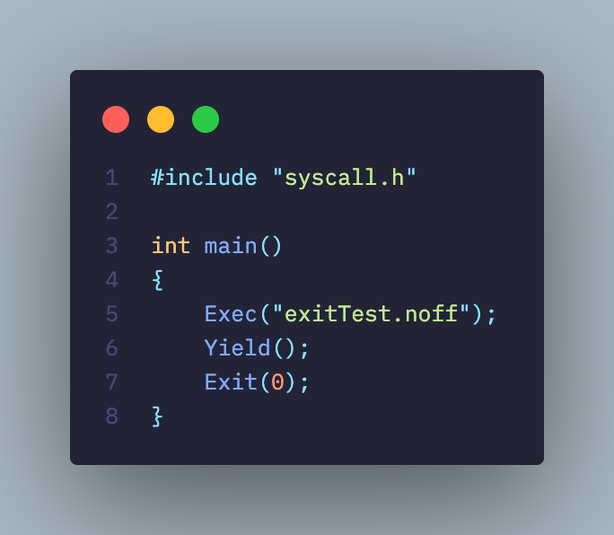

- 在`test`下，创建`exitTest.c`：

- 修改makefile，编译这三个新的用户程序：

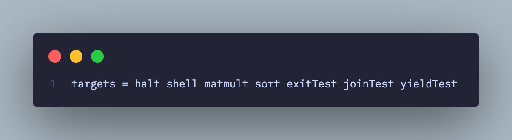

- 修改运行脚本，由于我们采用`nachos`内部文件系统：
	- 我们在用户程序编写中，采用的文件路径是`nachos`内部路径。
	- 所以我们提前把编译好的文件拷贝进`nachos`磁盘的根目录。
	- 对`lint.sh`做如下添加：

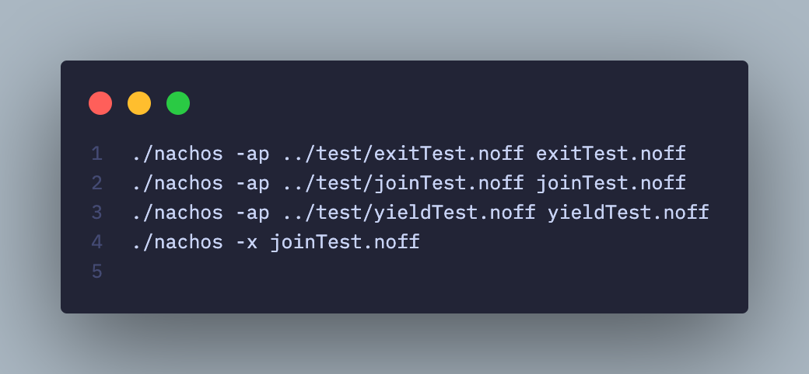

- 于是可以开始测试程序，有如下输出：

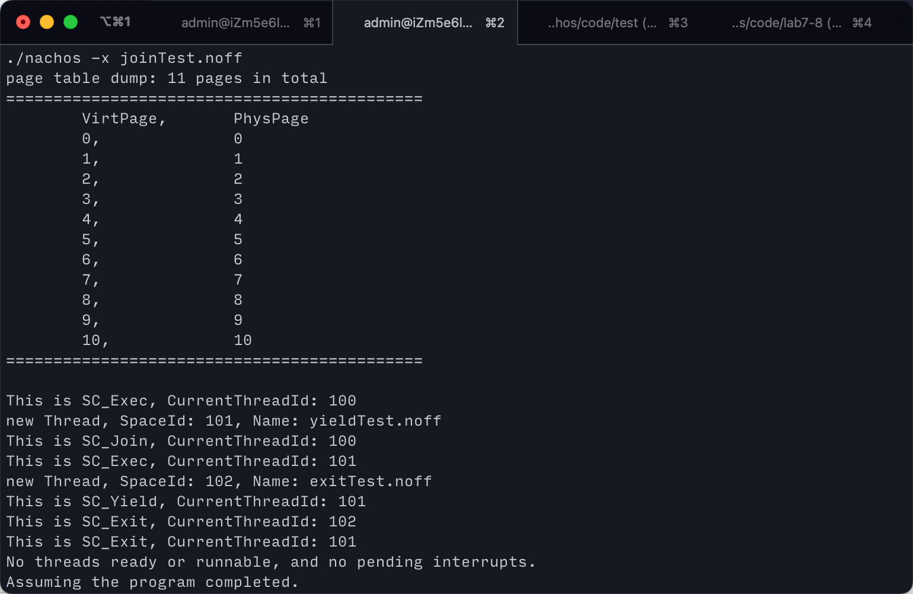

- 分析上述执行过程，可以发现具体执行顺序如下。
- 将/joinTest.noff 用户程序映射到 main 线程上，此时分配 SpaceId = 100。
	main 线程执行 Exec(/yieldTest.noff) 系统调用，并产生新用户程序/yieldTest.noff，并分配 SpaceId = 101。
- main 线程继续执行 Join() 系统调用，等待/yieldTest.noff 执行完毕，因此此时调度到线程/yieldTest.noff 上执行。
- /yieldTest.noff 线程执行 Exec(/exitTest.noff) 系统调用，并产生新用户程序/exitTest.noff，并分配 SpaceId = 102。
- /yieldTest.noff 继续线程执行 Yield() 系统调用，此时调度到/exitTest.noff 上继续执行。此时没有调度到 main 上继续执行，证明 main 线程此时在等待队列中，而非可运行态队列，也证实了 Join 系统调用执行正确。
- /exitTest.noff 执行 Exit() 系统调用，成为第一个结束的用户程序。接下来调度到/joinTest.noff 线程上继续执行。
- /joinTest.noff 执行 Exit() 系统调用，成为第二个结束的用户程序。由于/joinTest.noff 运行结束，因此重新调度到 main 上执行。
- 最后 main 执行 Exit() 系统调用，成为第三个结束的用户程序，此时 joinTest.noff 程序运行结束。
- 由上述的运行结果以及对于运行结果的分析，可以得知 Exec()、Exit()、Yield()、Join() 这四个系统调用均实现正确。

#### 运行文件相关系统调用综合测试

- 一开始是这样的：

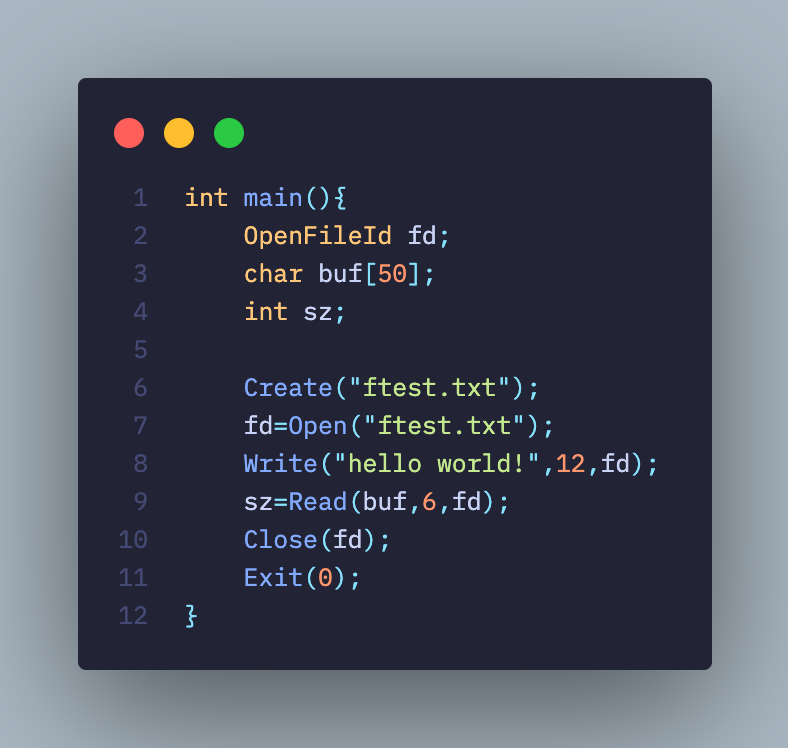

- 然后运行，发现：

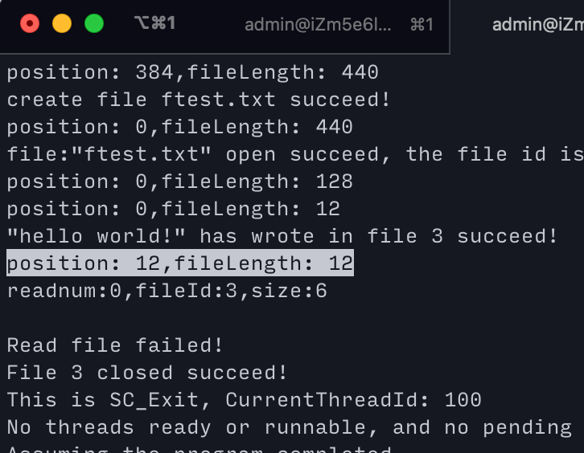

- 发现问题：写入文件后，不能正确地读取文件。
- 打印读写指针位置后，发现了问题：因为写入结束时，读写指针位于文件尾部。如果仍然从该位置开始读，可不报错吗！因为`Read`调用了`ReadAt`，而`ReadAt`有如下检查：

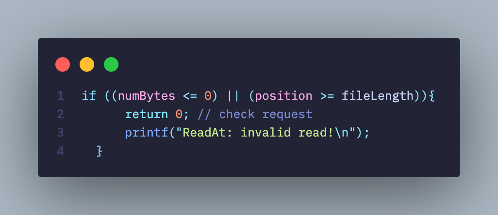

- 可见，如果读写指针位置不对，返回读取有效字节数0.
- 于是，需要实现`fseek`系统调用，或者重新打开文件以解决问题。

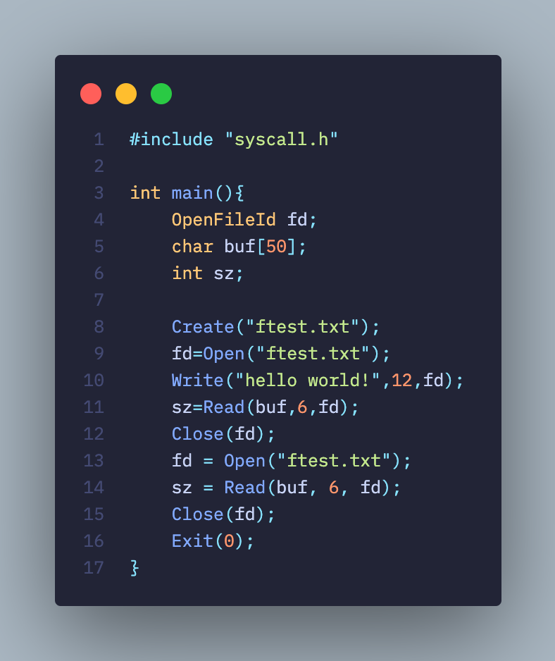

- 然后重新编译用户程序`fileTest.c` ，运行：

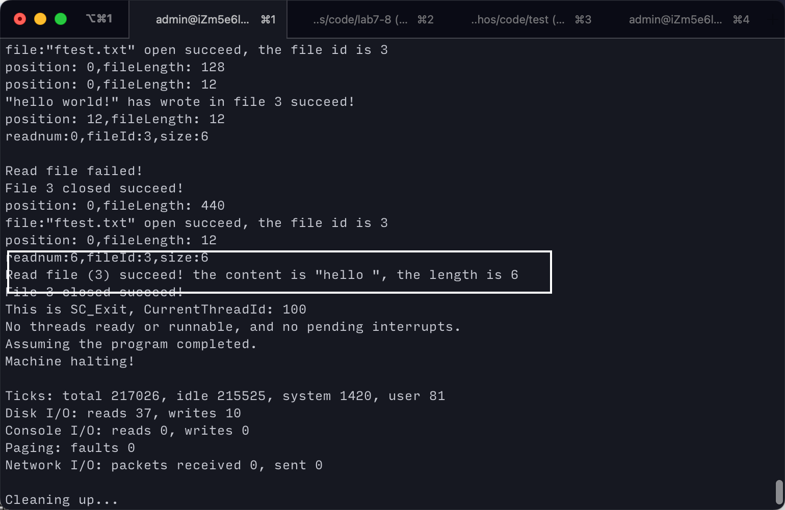

- 如图中方框所示，成功读取！
